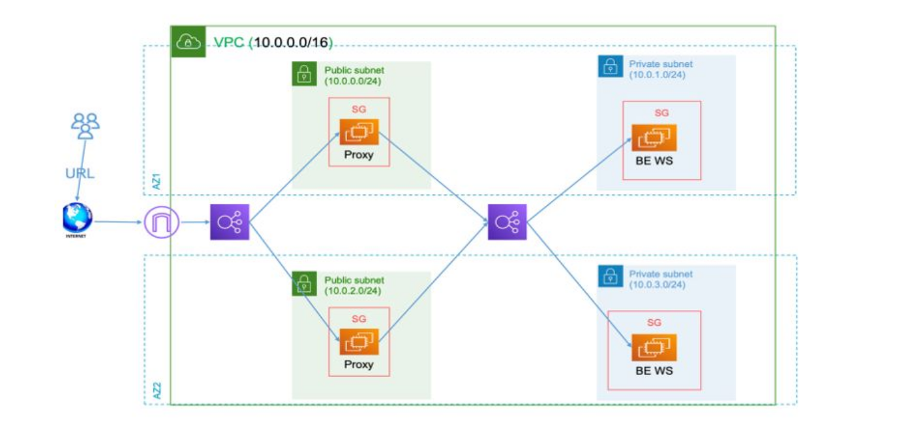

# Lab 3 - Multi-Tier Architecture with Load Balancers

This lab demonstrates a complete multi-tier architecture on AWS using Terraform, featuring public and private load balancers, reverse proxy configuration, and secure network segmentation.

## Architecture Overview



```
Internet → Public Load Balancer → Public Instances (Nginx Reverse Proxy)
    → Private Load Balancer → Private Instances (Apache Web Servers)
```

### Components

- **VPC**: Custom VPC with public and private subnets across 2 AZs
- **Public Load Balancer**: Application Load Balancer facing the internet
- **Public Instances**: EC2 instances running Nginx as reverse proxy
- **Private Load Balancer**: Internal Application Load Balancer
- **Private Instances**: EC2 instances running Apache web servers
- **NAT Gateway**: Provides internet access for private instances
- **Security Groups**: Layered security controlling traffic flow

## Infrastructure Components

### Network Layer

- **VPC**: `10.0.0.0/16` CIDR block
- **Public Subnets**: `10.0.0.0/24`, `10.0.1.0/24`
- **Private Subnets**: `10.0.2.0/24`, `10.0.3.0/24`
- **Internet Gateway**: Provides internet access for public subnets
- **NAT Gateway**: Enables private instances to reach the internet
- **Route Tables**: Separate routing for public and private subnets

### Compute Layer

- **Public Instances**: 2x t2.micro EC2 instances with Nginx
- **Private Instances**: 2x t2.micro EC2 instances with Apache
- **AMI**: Amazon Linux 2 (latest)
- **Key Pair**: SSH access via `labs_key`

### Load Balancing

- **Public ALB**: Internet-facing, distributes traffic to public instances
- **Private ALB**: Internal, distributes traffic to private instances
- **Target Groups**: Health checks and instance registration
- **Health Checks**: HTTP GET requests to `/` every 30 seconds

### Security

- **Public Security Group**: Allows HTTP (80) and SSH (22) from internet
- **Private Instance Security Group**: Allows HTTP from public SG and your IP for SSH
- **Private LB Security Group**: Allows HTTP from public instances and within VPC

## Traffic Flow

1. **User Request**: Browser → `http://lab3-public-lb-{id}.us-east-1.elb.amazonaws.com/`
2. **Public Load Balancer**: Distributes request to healthy public instance
3. **Nginx Reverse Proxy**: Forwards request to private load balancer
4. **Private Load Balancer**: Distributes request to healthy private instance
5. **Apache Web Server**: Serves content: `"Hello from Private Apache $(hostname)"`
6. **Response**: Travels back through the same path to user

## Prerequisites

- AWS CLI configured with appropriate credentials
- Terraform installed (>= 1.0)
- SSH key pair (`labs_key`) created in AWS
- Private key file at `~/.aws/labs_key.pem`

## Configuration Files

- `main.tf` - Main configuration orchestrating all modules
- `variables.tf` - Variable definitions and default values
- `outputs.tf` - Output values for load balancer URLs and instance IPs
- `backend.tf` - S3 backend configuration for state management
- `provider.tf` - AWS provider configuration

### Modules

- **network/**: VPC, subnets, routing, NAT gateway
- **instances/**: EC2 instances, security groups, provisioning
- **loadbalancer/**: Application load balancers, target groups, listeners

## Deployment

### 1. Initialize Terraform

```bash
cd lab3
terraform init
```

### 2. Review Plan

```bash
terraform plan
```

### 3. Deploy Infrastructure

```bash
terraform apply
```

### 4. Get Outputs

```bash
terraform output
```

## Accessing the Application

After deployment, use the public load balancer URL:

```bash
# Get the URL
terraform output public_load_balancer_dns

# Access the application
curl http://<public-lb-dns>/

# Health check endpoint (public instances)
curl http://<public-instance-ip>/health
```

## Testing and Validation

### Test Load Balancer

```bash
# Test public load balancer
curl -I http://$(terraform output -raw public_load_balancer_dns)/

# Should return: HTTP/1.1 200 OK
```

### Test Individual Components

```bash
# Test public instance health
curl http://<public-instance-ip>/health

# SSH to public instance
ssh -i ~/.aws/labs_key.pem ec2-user@<public-instance-ip>

# From public instance, test private load balancer
curl http://<private-lb-dns>/
```

## Key Features

### High Availability

- Multi-AZ deployment across 2 availability zones
- Load balancers distribute traffic across healthy instances
- Auto-healing through health checks

### Security

- Private instances isolated from direct internet access
- Layered security groups with principle of least privilege
- SSH access restricted to your IP address

### Scalability

- Modular architecture for easy expansion
- Load balancers support adding more instances
- Auto Scaling Groups can be added to modules

### Monitoring

- Load balancer health checks
- CloudWatch integration (built-in)
- nginx and Apache access logs

## Troubleshooting

### Common Issues

**504 Gateway Timeout**

- Check target group health in AWS Console
- Verify security group rules allow traffic
- Ensure private instances are in correct subnets

**SSH Connection Issues**

- Verify security group allows your IP
- Check private key permissions: `chmod 400 ~/.aws/labs_key.pem`
- Ensure key pair exists in AWS

**Nginx Configuration Issues**

- SSH to public instance and check: `sudo nginx -t`
- View logs: `sudo tail -f /var/log/nginx/error.log`
- Restart service: `sudo systemctl restart nginx`

### Useful Commands

```bash
# Check terraform state
terraform show

# View specific resource
terraform state show module.instances.aws_instance.lab3_public_instance[0]

# SSH to instances
ssh -i ~/.aws/labs_key.pem ec2-user@<public-ip>

# Test connectivity from public to private
ssh -i ~/.aws/labs_key.pem ec2-user@<public-ip> "curl -I http://<private-lb-dns>/"
```

## Cleanup

To destroy all resources:

```bash
terraform destroy
```

**Note**: This will permanently delete all infrastructure. Make sure to backup any important data.

## Customization

### Adding More Instances

Modify the `count` parameter in the instances module:

```hcl
resource "aws_instance" "lab3_public_instance" {
  count = 3  # Increase from 2 to 3
  # ... rest of configuration
}
```

### Changing Instance Types

Update the variable in `variables.tf`:

```hcl
variable "instance_type" {
  default = "t3.micro"  # Change from t2.micro
}
```

### Custom Nginx Configuration

Modify the nginx configuration in the `null_resource` provisioner in `main.tf`.

## Security Considerations

- Private instances have no direct internet access
- SSH access is restricted to your IP address
- Security groups follow least privilege principle
- All traffic between tiers is controlled by security groups
- SSL/TLS termination can be added at load balancer level

## Cost Optimization

- Uses t2.micro instances (free tier eligible)
- Single NAT Gateway (can be made highly available)
- Application Load Balancers (cost-effective for HTTP traffic)
- Resources can be stopped/started as needed

## Next Steps

- Add SSL/TLS certificates for HTTPS
- Implement Auto Scaling Groups
- Add CloudWatch monitoring and alarms
- Integrate with AWS Certificate Manager
- Add WAF for additional security
- Implement blue-green deployments
